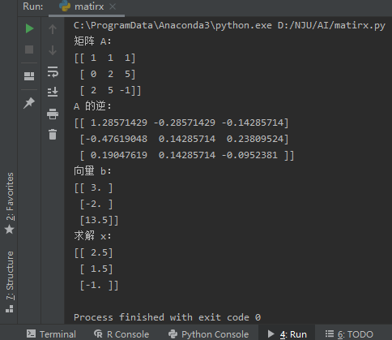

# HW2-b4-03-24-2200


## 题目 2

### (1)

令
$$

A = {\left [\begin {matrix} 1 &1 &1 \\0 & 2 & 5 \\2 & 5 & -1\end {matrix} \right]}
, B = {\left [\begin {matrix} 3 \\-2 \\13.5 \end {matrix} \right]}, x = {\left [\begin {matrix} x \\ y \\ z \end {matrix} \right]}
$$
则原方程组可表示为
$$
A x = b
$$
的形式。


### (2)

#### 运行截图




#### 源代码

添加代码后的源代码在附件中已提供。但此处再发一次。

```python
import numpy as np

# 初始化A矩阵
A = np.array([[1, 1, 1], [0, 2, 5], [2, 5, -1]])

print('矩阵 A：')
print(A)

# 求A 的逆
A_inv = np.linalg.inv(A)

print('A 的逆：')
print(A_inv)

# 初始化向量b
b = np.array([[3], [-2], [13.5]])
print('向量 b：')
print(b)

# 求解x
print('求解 x：')
x = A_inv.dot(b)
print(x)
```

